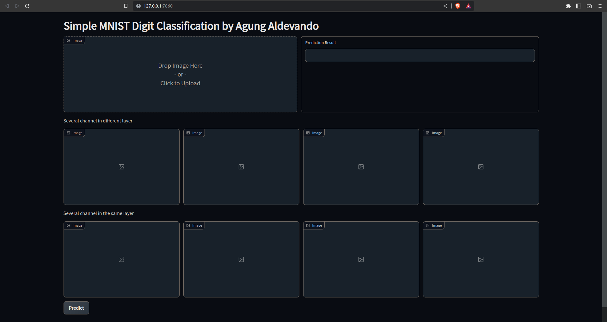

# Simple MNIST Digit Classifier
Simple MNIST digit classifier with Gradio demo.
<div id="header" align="center">
  
</div>

To use this repo, first install the necessary packages, e.g. via:
```bash
pip install -r requirements.txt
```

Then start the demo via:
```bash
python code/app.py
```
